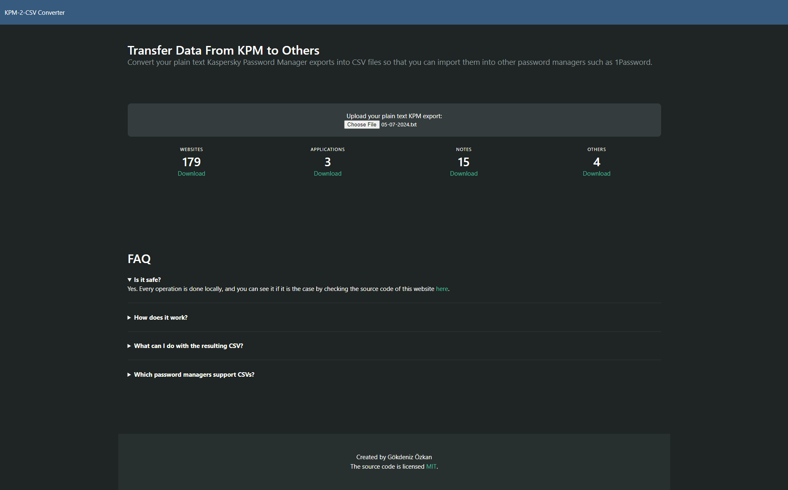

# Online KPM-2-CSV Converter

Convert Kaspersky Password Manager exported credentials into CSV file, online. This converter supports 4 types of entries:
- Website logins.
- Application logins.
- Custom logins (named as Other).
- Secure notes.

Converter is designed to handle all types of entries at once. Just grab your credentials export file, and upload it.

## How to use

1. Export your credentials from KPM.
2. Navigate to the [app.gokdenizozkan.com/kpm2csv](https://app.gokdenizozkan.com/kpm2csv) address.
3. Upload the plain text file you got at point #1.
4. Download the CSV file corresponding the entry types.

## Why bother to write a conversion tool

I was using Kaspersky Password Manager, and wanted to switch to 1Password. However, KPM's export options were limited to text, which was unique to KPM and was not supported by any other tool.

I found other conversion tools but they were either:
1. Closed source, could not see the underlying code. (! No way I upload my passwords into that. !)
2. Required me to build or clone the repository, while not offering a complete suite of solutions.

Why not write my own conversion tool that would work on the Web thanks to HTML and JS with no expenses on my side (!), I told to myself. So, here I am, writing this README.md file.

## Technologies used

### Languages
- HTML 5
- JavaScript

### Libraries^*
- BULMA CSS Library
- Darkly, a BULMA theme

^* Unused CSS classes of both library and theme are removed.